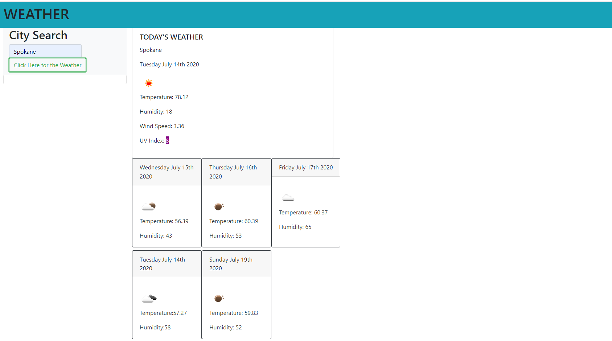

# 06 Server-Side APIs: Weather Dashboard

In this project I created a Weather Dashboard so that when a...
//A user types a city
//A user submits their search
//then the currrent weather of that city shows up
// the City Name
// the Date
// the Icon
// the Temp
// the Humidity
// the Wind Speed
// the UV Index
//They also see the 5 day forecast of their city that they searched
//the date,
//an icon representation of weather conditions,
//the temperature,
//and the humidity

I am currently working on getting the local storage up and running. I would like to populate the past seaches into generated unordered lists.

//If the user searches for another city, then their past city search is saved
//The user can click on past city searches and view the weather

